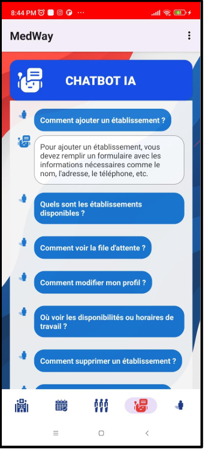

# MedWay: Intelligent Mobile Health Services Application

An intelligent mobile application for streamlined access to healthcare services, designed for patients, healthcare professionals, and administrators.

[](https://www.java.com)
[](https://developer.android.com)
[](https://firebase.google.com/docs/firestore)
[](https://developer.android.com/jetpack/guide)
[](https://opensource.org/licenses/MIT)

---

## 📖 About The Project

**MedWay** is an innovative Android application developed to modernize the healthcare ecosystem. It addresses the common challenges faced by both patients and healthcare providers, such as difficulties in finding medical facilities, managing appointments, and handling administrative tasks.

By leveraging modern mobile technologies, real-time data, and artificial intelligence, MedWay provides a unified, intuitive, and efficient platform. It aims to improve the accessibility, quality, and coordination of healthcare services, creating a seamless and transparent experience for all users.

This project was developed as part of the Geo-Information Engineering program at the Faculty of Sciences and Techniques of Tangier.

---

## ✨ Key Features

MedWay offers a rich set of features tailored to its three main user roles:

### For Patients
*   **🏥 Search for Healthcare Facilities:** Find hospitals, clinics, pharmacies, and more using an interactive map.
*   **🔍 Advanced Filtering:** Filter search results by distance, specialty, availability, and accessibility (e.g., for people with reduced mobility).
*   **📅 Online Appointment Booking:** View real-time availability and book, consult, or cancel appointments with ease.
*   **📂 Digital Medical Records:** Create, view, update, and delete your personal health records, including medical history, allergies, and treatments.
*   **🤖 AI-Powered Chatbot:** Get instant help with navigating the app, booking appointments, or asking general health-related questions.
*   **⭐ Ratings & Reviews:** Share feedback on healthcare providers and services to help the community.

### For Healthcare Professionals
*   **🏢 Establishment Management:** Create and manage profiles for one or more healthcare facilities.
*   **🗓️ Availability Management:** Set and update working hours and available appointment slots.
*   **📊 Waiting Queue Management:** View and manage the live queue of patients waiting for consultation.
*   **👤 Profile Management:** Update personal and professional information securely.
*   **💬 Access to AI Chatbot:** Use the assistant for quick information and support.

### For Administrators
*   **✅ Account Verification:** Approve or reject registration requests from new healthcare professionals.
*   **📈 System Monitoring & Analytics:** Supervise system activity, generate statistical reports on platform usage, and monitor patient flows.
*   **🔐 Access Control:** Manage user permissions and ensure system security.
*   **🗺️ GIS Data Supervision:** Oversee the geographic information system data for accuracy and reliability.

---

## 🛠️ Architecture & Tech Stack

MedWay is built on a robust and scalable architecture, following modern Android development best practices.

*   **Architecture:** **MVVM (Model-View-ViewModel)** to ensure a clear separation of concerns, making the code modular, testable, and maintainable.
*   **Language:** **Java**
*   **UI Layout:** **XML**
*   **Platform:** **Android** (developed with Android Studio)
*   **Backend & Database:**
    *   **[Firebase Authentication](https://firebase.google.com/docs/auth):** For secure user registration and login.
    *   **[Cloud Firestore](https://firebase.google.com/docs/firestore):** As the primary real-time NoSQL database for all application data.
*   **APIs & Libraries:**
    *   **[OpenStreetMap (OSM)](https://www.openstreetmap.org/):** For base map data.
    *   **[Overpass API](https://wiki.openstreetmap.org/wiki/Overpass_API):** To query and extract geolocated data of healthcare facilities.
    *   **[Material Components for Android](https://material.io/develop/android):** For a modern, consistent, and user-friendly UI.
    *   **[Glide](https://github.com/bumptech/glide):** For efficient image loading and caching.
    *   **RecyclerView:** For displaying dynamic lists of data efficiently.
    *   **AI Chatbot:** Integrated with a locally executed language model for fast and private user assistance.

---

## 📸 Screenshots

| Login & Signup | Create Facility Profile | Admin Dashboard |
| :---: |:---:|:---:|
|  |  |  |

| Patient Signup | Manage Availability | AI Chatbot |
| :---: |:---:|:---:|
|  |  |  |

---

## 🚀 Getting Started

To get a local copy up and running, follow these simple steps.

### Prerequisites

*   [Android Studio](https://developer.android.com/studio) (latest version recommended)
*   A Git client

### Installation

1.  **Clone the repository:**
    ```sh
    git clone https://github.com/your-username/MedWay.git
    ```
2.  **Open the project in Android Studio.**
3.  **Set up Firebase:**
    *   Go to the [Firebase Console](https://console.firebase.google.com/).
    *   Create a new Firebase project.
    *   Register your Android app with the project. Make sure the package name matches the one in `AndroidManifest.xml`.
    *   Download the `google-services.json` file provided by Firebase.
    *   Place the `google-services.json` file in the `app/` directory of your project.
    *   In the Firebase Console, enable **Authentication** (with Email/Password provider) and **Cloud Firestore**.
4.  **Build and run the application:**
    *   Let Android Studio sync the Gradle files.
    *   Build the project and run it on an Android emulator or a physical device.

---

## 🗺️ Roadmap

We have a clear vision for the future of MedWay. Here are some of the planned enhancements:

-   [ ] **Teleconsultation Module:** Integrate a secure video-conferencing feature for remote consultations.
-   [ ] **Web Portal:** Develop a synchronized web version for better accessibility on desktops.
-   [ ] **IoT Integration:** Connect with health monitoring devices (e.g., smartwatches) to automatically sync patient data.
-   [ ] **Enhanced Offline Support:** Improve offline capabilities for accessing medical records without an internet connection.
-   [ ] **Advanced AI:** Implement predictive algorithms for appointment demand and personalized provider recommendations.
-   [ ] **Public Health System Integration:** Achieve interoperability with national health record systems.
-   [ ] **HDS & GDPR Compliance:** Pursue certifications for hosting health data to ensure the highest level of security and trust.

---

## 🤝 Contributing

Contributions are what make the open-source community such an amazing place to learn, inspire, and create. Any contributions you make are **greatly appreciated**.

If you have a suggestion that would make this better, please fork the repo and create a pull request. You can also simply open an issue with the tag "enhancement".

1.  Fork the Project
2.  Create your Feature Branch (`git checkout -b feature/AmazingFeature`)
3.  Commit your Changes (`git commit -m 'Add some AmazingFeature'`)
4.  Push to the Branch (`git push origin feature/AmazingFeature`)
5.  Open a Pull Request

---

## 📜 License

Distributed under the MIT License. See `LICENSE.md` for more information.

---

## 🧑‍💻 Authors & Acknowledgments

### Project Team
*   **EL OUALI Taha**
*   **ALLALI Mohamed Amine**
*   **LHANNAOUI Leila**
*   **NEBKHOUT Hanae**

### Project Supervisor
*   **Pr. KHALFAOUI Hafida**

We extend our sincere gratitude to our supervisor for her invaluable guidance and support throughout this project.
